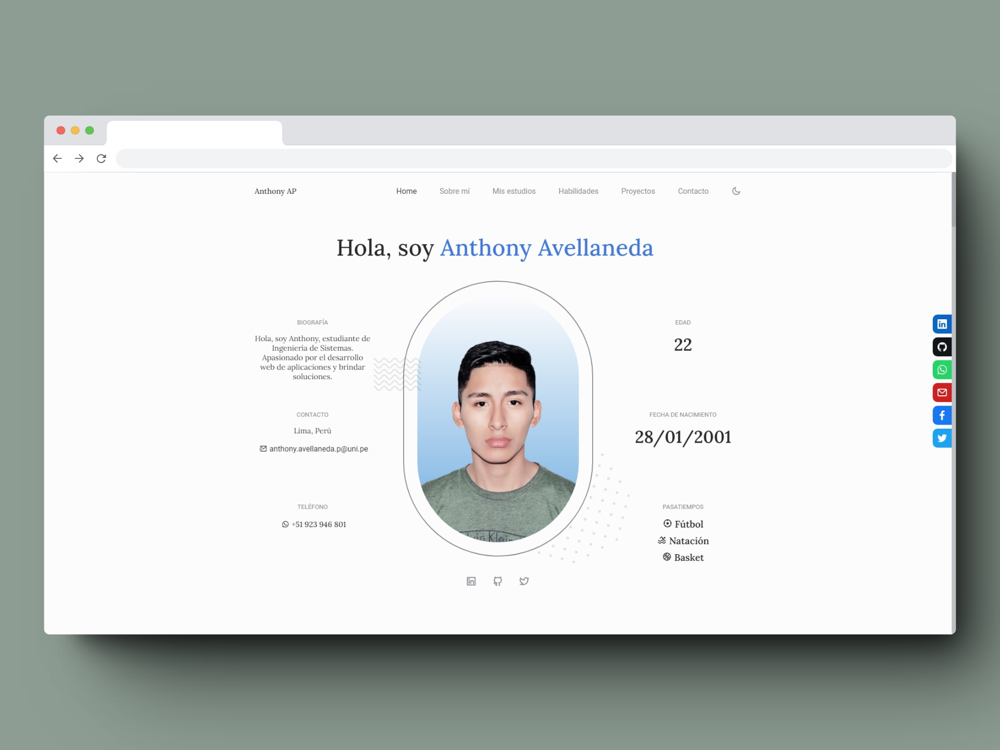
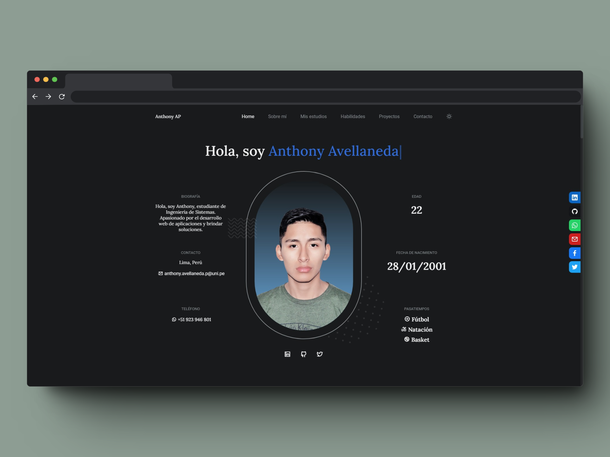

# 💼 Hello, I'm Anthony Avellaneda! 👋
## [View Live Demo 👀](https://portafolio-anthony-avellaneda.vercel.app/)
### 💼 Responsive Personal Portfolio Website

Welcome to my portfolio on GitHub. Here you can explore some of my projects and learn more about me and my programming skills.

Welcome to my portfolio on GitHub. Here you can explore some of my projects and learn more about me and my skills as **Angular**, **React**, **Java**, **JavaScript**, **TypeScript**, **Spring Boot**, **PostgreSQL** and **Git.**

## Featured projects

### [Snap URL](https://snap-url.netlify.app/home)
It is an innovative web application that simplifies the way you share links. With its intuitive interface, you can shorten long URLs and generate QR codes in a matter of seconds. Do you want to share content quickly and efficiently? SnapURL is your solution. Join the link shortening revolution.

### [SmartEngageBot: Chatbot & Email Marketing](https://magio-academy.netlify.app/)
A solution driven application for Magio Academy, addressing the lack of timely communication with users and potential customers. With a chatbot that automatically responds to queries, it provides information about the company, its services and payment methods in multiple languages. Additionally, a subscription popup offers a discount coupon for courses, followed by a welcome email upon subscription, improving customer engagement and interest in company offerings.

## How to Contact Me

If you want to work with me on a project or just chat, don't hesitate to contact me!

- Email: [anthony.avellaneda.p@uni.pe](mailto:anthony.avellaneda.p@uni.pe)
- LinkedIn: [Anthony Avellaneda Paitán](https://www.linkedin.com/in/AnthonyAvellanedaPaitán/)
- Twitter: [**@TomStark08**](https://twitter.com/TomStark08)
- WhatsApp: [+51 923 946 801](https://api.whatsapp.com/send?phone=51923946801)

## About me

I'm a Systems Engineering student with a passion for solving problems using technology. I love learning new things and working in a team, and I like to contribute ideas and create a collaborative environment.

---

Thanks for visiting my portfolio! I hope you have enjoyed exploring my projects as much as I have enjoyed creating them. Feel free to connect with me and share your ideas.

### Light mode 💡

### Dark mode 🌑

